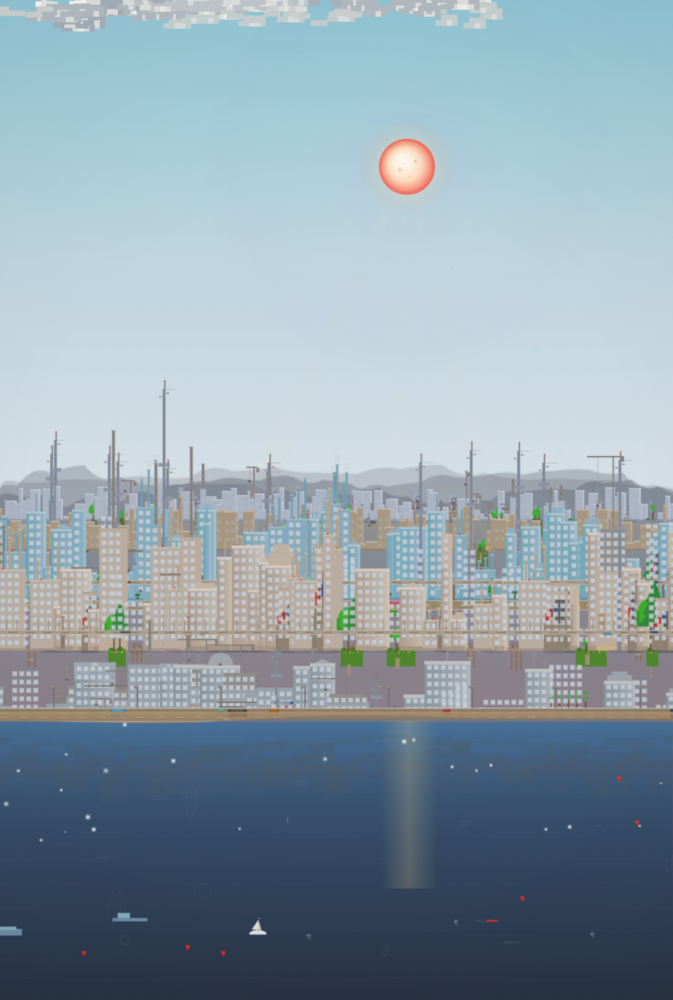
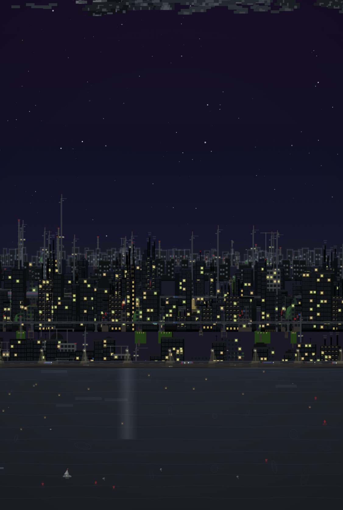
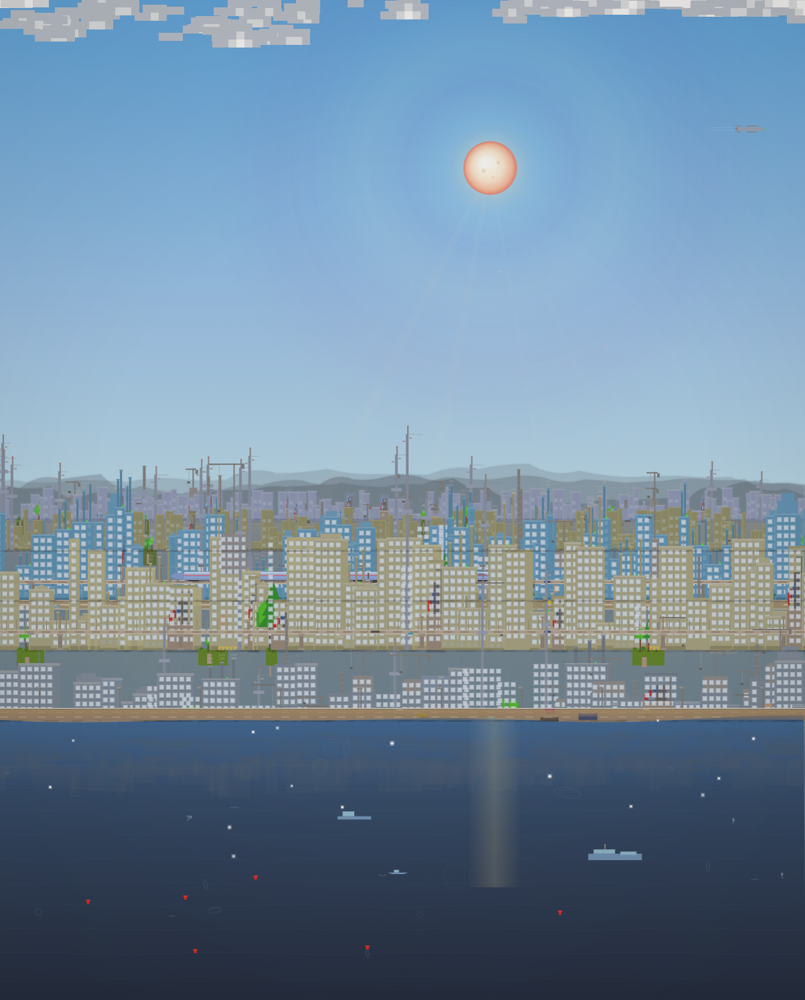
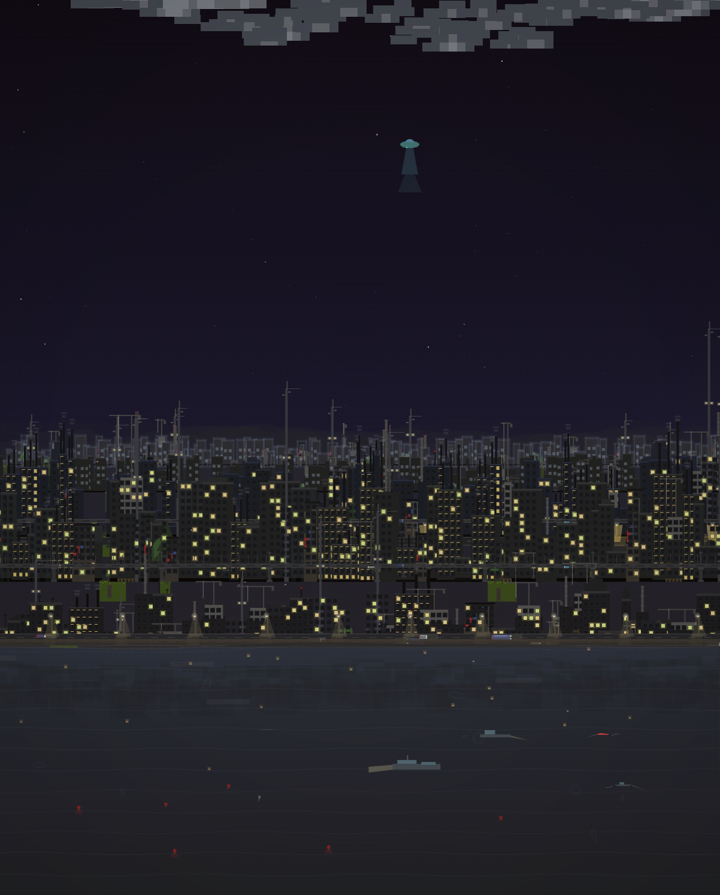
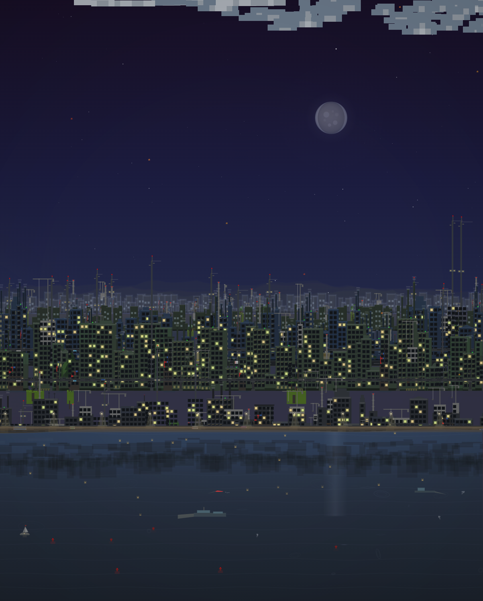
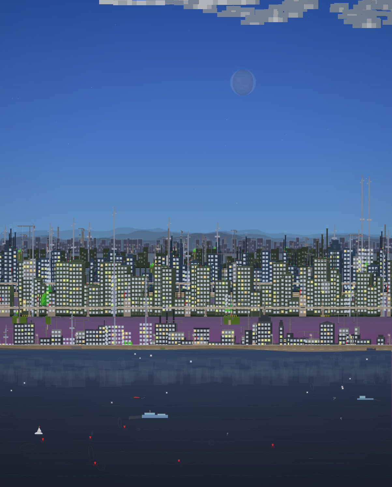

# CityTone

A single-file music player and audio visualizer that transforms your music into a living, breathing pixel-art cityscape — with three auto-detected scenes: CityTone (cityscape), Universe (galaxy), and Jungle (rainforest). Buildings pulse to the beat, weather shifts dynamically, seasons cycle, the sun rises behind mountains, Godzilla roams the waterfront, and hidden easter eggs drift across the skyline.

## Preview

| Day | Night | Dawn | Rain | Autumn | Winter |
|-----|-------|------|------|--------|--------|
|  |  |  |  |  |  |

## Quick Start

1. Open `LaunchPulse.html` in any modern browser
2. Click **Playlist** or **Play** to open the drop zone
3. Drag audio files onto the scene or click **Browse Files**
4. The visualizer auto-detects music style and switches scenes:
   - **Energetic music** → CityTone cityscape
   - **Meditation / calm music** → Universe galaxy
   - **Nature sounds** → Jungle rainforest

No build tools, no dependencies, no installation. Everything runs in a single HTML file.

## Features

### 3-Scene Auto-Detection (v4.0+)

- **Automatic scene switching**: Music is analyzed for ~1.5s, then the best-matching scene is selected
- **Nature sound detection**: Sustained mid/high frequencies with low bass → Jungle scene
- **Meditation detection**: Low energy, smooth frequency distribution, no beats → Universe scene
- **Idle cycling**: Auto-cycles City → Galaxy → Jungle every ~10s when no music plays
- **Smooth transitions**: ~0.6s cross-fade with continuous scrolling during transitions

### Music-Reactive Cityscape

- 5 parallax layers of buildings scrolling at independent speeds, each assigned to one of 8 audio frequency bands
- Buildings smoothly animate between 30% and 250% of their base height based on their frequency's energy
- Window lights flicker and illuminate dynamically with the music
- Dense random overlap with zero-gap filling — the skyline stretches 2.5x the screen width

### Jungle Scene (v3.0+)

- **Epic wide-screen scaling** (v5.0): Pixel budget up to 2.5M for crisp, non-stretched landscapes on ultra-wide displays
- **Amazon rainforest river journey** with pixel-art style (no sprites)
- **34 draw functions** covering: sky, sun/moon, clouds, wave mountains, cliff mountains, tropical ridges, mountain trees, Aztec pyramids/statues/temples, far/mid/near forest, mossy hills, waterfalls, river with reflections, foreground vegetation
- **Dynamic weather**: clear sky → partly cloudy → cloudy → overcast → fog → light rain → rain → thunderstorm → heavy rain
- **Day/night cycle** with sun/moon sky-disk synchronization (sun rises left, peaks center, sets right)
- **Golden hour lighting**: warm orange/pink/gold cloud lighting at dawn/dusk, depth-weighted
- **Wildlife easter eggs**: gibbons with trailing vines, parrots, butterflies, crocodiles, panther chase, thunder-lit tree
- **Audio-reactive**: tree trunk pulsing, water wave amplitude, Tyndall beams, firefly behavior, flower bloom
- **Nature sound detection**: river energy (mid-freq) and rain energy (high-freq) drive visual effects
- **Idle weather system**: random transitions every 10-18s (no music) or 25-40s (with music)
- **4-layer cache system**: bg (6fr), mid (4fr), hill (6fr), anim (2fr) with up to 3 refreshes per frame + starvation prevention

### Adaptive Audio & Disco Pitfire (v5.1+)

- **Adaptive beat detection**: Rolling bass baseline adapts to quiet/loud tracks for robust beat triggering
- **Audio-driven weather**: Rain sounds trigger rain after 3s, heavy rain after 5s, with anti-flicker logic
- **Waterfall flow boost**: River sounds enhance waterfall width and foam speed in real-time
- **Disco pitfire gathering**: When the disco ball activates at night with CityPop music, gorillas, monkeys, and gibbons gather around a campfire in the foreground — pixel art, per-frame animation, beat-synced
- **Firefly spark patterns**: Firebugs form disco ball reflection spark patterns during the event
- **Bat spotlight system**: Bats and birds drop colored cone spotlights on gorillas while flying overhead
- **Disco illumination**: Warm ground glow and sky shimmer boost during the event
- **CityTone toggle (v5.1.3)**: A "City Tone" button appears in the top-right corner when the disco ball is active in jungle mode, allowing instant switching to the cityscape scene
- **Stop-motion prevention**: Per-frame music FX overlay for all audio-reactive effects (60fps smooth)

### Universe Scene (Galaxy Mode)

- Triggered by meditation/calm music with low energy and smooth frequency distribution
- Smooth ~0.6s crossfade transition between cityscape and deep space
- 400 pixel-art stars with depth-based parallax scrolling
- 14 solar systems with procedurally textured planets based on real-world planetary surfaces
- Scroll wheel zoom (0.3x to 6x) for solar system exploration
- Auto fly-through with drifting nebulae, dust clouds, and asteroid fields

### Day/Night Cycle

- Smooth sun arc across the sky with spherical radial gradient, sunspots, and corona shimmer
- Sun rises from behind the mountain horizon with glow intensifying through Gaussian proximity
- Detailed moon with soft blue-white glow, maria regions, craters, ray system, and accurate phase shadows
- Rotating star field with twinkling and trailing streaks
- 9 sunset/dawn palettes cycling through rose-magenta, tropical gold, volcanic red, and more
- Cosine-eased transitions for silky-smooth day-to-night shifts

### Dynamic Weather

- 10 cloud types with unique size, shape, position, and speed
- 16 weather conditions with natural transitions: clear sky, rain, snow, fog, thunderstorms, dust storms, hail
- Rain with diagonal wind-angled streaks, splash dots, and mist
- Snow with star-shaped flakes, wind gusts, and whiteout overlay in blizzards
- Snow accumulation on building rooftops
- Rainy weather causes flooding with water level rise
- Lightning strikes with screen shake

### Seasons

- Spring, summer, autumn, winter with smooth blending transitions
- Autumn shortens daytime hours; winter brightens nighttime illumination
- Season-specific particles: cherry blossoms, falling leaves, frost sparkles
- Vegetation changes: green canopies, golden leaves, bare branches with snow
- Street trees and parks with 5 distinct tree shapes respond to seasonal changes

### Ships on the Water

- **Spanish Galleon Flagship**: 3-masted square-rigger with dramatically billowing white sails, ornate stern castle with gallery windows, forecastle with bowsprit, 10 gunports, rigging lines, and a red flag
- **Modern Cruise Liner**: Navy blue hull, white superstructure with 8 passenger decks, twin funnels with navy caps and dynamic smoke puffs, turquoise swimming pool with sun loungers, orange lifeboats, bridge with angled windshield and wings
- Ships face their travel direction and follow randomized water surface tracks

### Ferris Wheel

- Giant observation wheel randomly appearing near the waterfront in the foreground layer
- 16 enclosed white gondola cabins with warm window glow at night
- Animated LED light shows: 64 outer rim lights (3-color chasing), 32 mid-ring lights, 16 inner ring lights
- Idle rotation speed increases when music is playing
- Water reflections at night

### Easter Eggs

- **Godzilla**: Giant monster roaming the waterfront with glowing eyes, dorsal fins, and atomic breath
- **Famous buildings**: Oriental Pearl Tower, Tokyo TV Tower, Burj Khalifa, CCTV Headquarters, Golden Gate Bridge, Eiffel Tower, Forbidden City, Summer Palace
- **UFO** with tractor beam abducting road vehicles
- **Airplanes** with contrails and blinking navigation lights
- **Fireworks** with rockets, multi-color explosions, and flash glow
- **Modern arch bridges** in 3 styles: cable-stayed, parabolic, tied-arch
- Famous buildings feature night flashing lights and laser beams

### Holiday Events

- **Mid-Autumn Festival**: Brightest full moon, bird couple silhouette, V-formation flock
- **Christmas Eve**: Santa Claus with reindeer, sleigh, gift bag, and magic dust trail

### Urban Details

- High-speed bullet train with aerodynamic nose on elevated viaduct, catenary poles
- Multi-lane roads with traffic, headlights, and taillights
- Street lamps with light cones at night
- Parks with season-responsive trees, bushes, benches, and paths
- TV towers with blinking aviation beacons
- Jetties with wooden decks, railings, and mooring posts
- Seawalls with stone block pattern and drainage pipes

### Water

- Composite wave surface with slow tides
- Water reflections of buildings and celestial bodies
- Sky reflection band, sun sparkles, and expanding ripples

### Aurora Borealis

- Animated aurora curtains visible only during winter night under clear sky
- 5-8 independent curtain straps with unique wave frequency, hue, and drift
- Multi-frequency wave motion for organic flowing movement
- Music energy brightens aurora intensity by up to 35%

### Audio Player

- Full playlist management with drag-and-drop file support
- Large drop zone for easy file adding
- Shuffle and repeat modes
- Volume control and track name display
- Save/Load playlist to localStorage

### UI Optimization

- Smooth CSS transitions (0.25s) on all UI elements — no flash or blink
- Throttled `_showUI` to avoid unnecessary DOM touches on mousemove
- Auto-hide UI after 3s of inactivity for immersive viewing
- Mouse parallax and drag disabled in universe scene for stable viewing

## Keyboard Controls

| Key | Action |
|-----|--------|
| `Space` | Play / Pause |
| `Left/Right` | Previous / Next track |
| `Up/Down` | Volume up / down |
| `Scroll` | Zoom in/out (Universe scene only) |

Scenes switch automatically based on music style — no manual controls needed.

## Technical Architecture

- **Rendering**: HTML5 Canvas 2D — `fillRect`, `arc`, `bezierCurveTo`, gradient fills, pixel-art scale
- **Audio**: Web Audio API `AnalyserNode` for real-time FFT frequency data (8 bands); Jungle reuses main player's frequency data (no redundant FFT)
- **Performance**: Gradient caching, `fillRect` batching by color, stroke path batching, 4-layer cache system (Jungle)
- **Scene System**: Auto-detection with 90-frame evaluation window; nature sounds → Jungle, meditation → Universe, other → City
- **Wide-Screen Scaling**: `_resScale` (screen resolution) × `_wideScale` (aspect ratio) drive pixel budget (up to 2.5M) and element counts
- **Weather State Machine**: Weighted adjacency graph with cosine-eased transitions
- **Season System**: Sequential cycle with smooth blend interpolation
- **Parallax**: 5 cityscape layers / 6 jungle layers with independent scroll speeds, endless wrapping
- **Error Resilience**: Both main and Jungle loops log errors and continue (never kill rAF chain)

## File Structure

```
LaunchPulse.html             Main application (3 scenes: City, Universe, Jungle)
disco-ball-test.html         Disco ball event verification script
screenshots/                 Preview images
citytone-intro/              Intro page with screenshots
development-guide/
  development-guide.html     Version history & changelog
  development-manual.html    Architecture, modules, performance, extending guide
  prompt-development-manual.html  AI prompt templates & constraints reference
```

## Development Guide

The `development-guide/` folder contains three documents:

- **[Development Guide & Changelog](development-guide/development-guide.html)** — Full version history from v1.0 to v5.1.4
- **[Development Manual](development-guide/development-manual.html)** — Architecture overview, core modules (Player, ToneSync, JUNGLE), performance optimization techniques, disco ball event system, audio coupling, testing procedures, and hard constraints
- **[Prompt Development Manual](development-guide/prompt-development-manual.html)** — AI-assisted development guide with prompt templates for features, bugfixes, performance optimization, visual enhancements, audio coupling, disco ball events, testing, and anti-patterns

## Browser Support

- Chrome 80+
- Firefox 80+
- Safari 14+
- Edge 80+

## License

MIT
