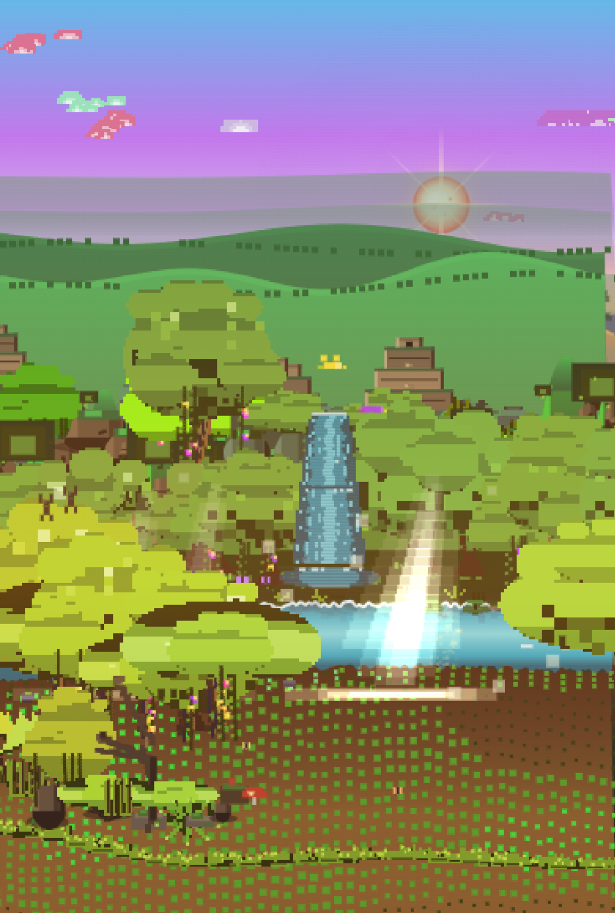
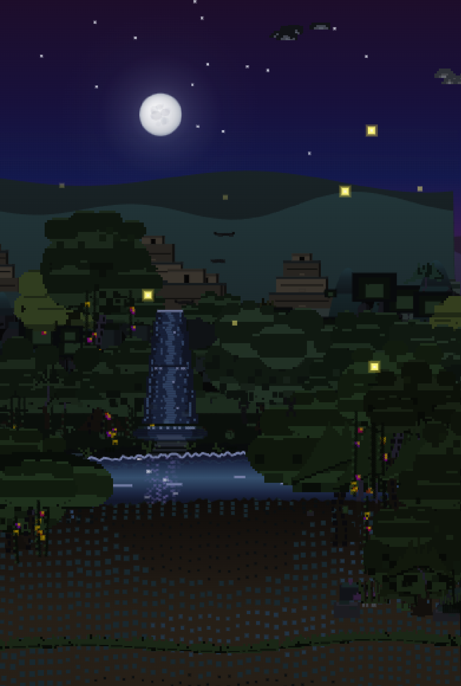
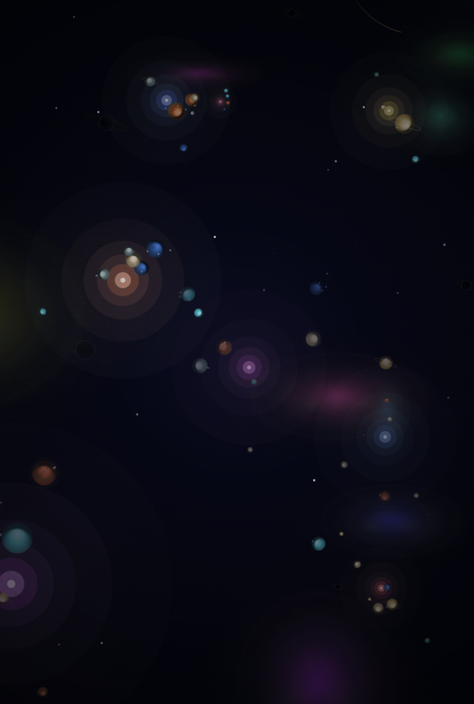

# CityTone

A single-file music player and audio visualizer that transforms your music into a living, breathing pixel-art cityscape — with three auto-detected scenes: CityTone (cityscape), Universe (galaxy), and Jungle (rainforest). Buildings pulse to the beat, weather shifts dynamically, seasons cycle, the sun rises behind mountains, Godzilla roams the waterfront, and hidden easter eggs drift across the skyline.

## Preview

| Day | Night | Jungle Day | Jungle Night | Galaxy |
|-----|-------|------------|--------------|--------|
|  |  |  |  |  |

## Quick Start

1. Open `LaunchPulse.html` in any modern browser
2. Click **Playlist** or **Play** to open the drop zone
3. Drag audio files onto the scene or click **Browse Files**
4. The visualizer auto-detects music style and switches scenes:
   - **Energetic music** → CityTone cityscape
   - **Meditation / calm music** → Universe galaxy
   - **Nature sounds** → Jungle rainforest

No build tools, no dependencies, no installation. Everything runs in a single HTML file.

## Features

### 3-Scene Auto-Detection (v4.0+, rewritten v5.3.2, retro support v5.3.4)

- **Automatic scene switching**: Music is analyzed for ~3s, then the best-matching scene is selected via score comparison
- **Nature sound detection**: Spectral flatness + low bass + high-freq dominance → Jungle scene
- **Meditation detection**: Spectral flatness + low energy + low dynamic range + no beats → Universe scene
- **Energetic music detection** (v5.3.2): Strong bass + percussive transients + tonal spectrum → City scene (positive detection, not just fallback)
- **Retro music detection** (v5.3.4): Moderate energy + mid-frequency dominance + present-but-moderate bass + tonal content → Jungle scene. Detects 80s synth, city pop, retro wave, yacht rock — retro score competes with energetic score for scene selection
- **Continuous scoring** (v5.3.2): All detectors use gradual/continuous scoring instead of binary thresholds for robust, stable detection
- **Idle cycling**: Auto-cycles City → Galaxy → Jungle every ~10s when no music plays
- **Smooth transitions**: ~0.6s cross-fade with continuous scrolling during transitions

### Music-Reactive Cityscape

- 5 parallax layers of buildings scrolling at independent speeds, each assigned to one of 8 audio frequency bands
- Buildings smoothly animate between 30% and 250% of their base height based on their frequency's energy
- Window lights flicker and illuminate dynamically with the music
- Dense random overlap with zero-gap filling — the skyline stretches 2.5x the screen width

### Jungle Scene (v3.0+, complete redraw v5.6.0)

- **Epic wide-screen scaling** (v5.0): Pixel budget up to 2.5M for crisp, non-stretched landscapes on ultra-wide displays
- **Amazon rainforest river journey** with pixel-art style (no sprites)
- **Cityscape-style smooth rendering** (v5.6.0): ALL terrain functions rewritten to use smooth `quadraticCurveTo` path rendering — identical approach to cityscape's `drawMountains()` and `drawWater()`. Replaces column-by-column `fillRect` with `beginPath()` + `quadraticCurveTo()` mid-point smoothing for organic, flowing silhouettes. 120+ control points across screen width for ultra-smooth curves
- **Aztec stepped pyramid temples** (v5.6.0): `drawRemoteTemples()` redesigned as Aztec stepped pyramids with layered construction, alternating stone tones, volumetric shading, central stairways, stone block textures, and moss. `drawAztecPyramids()` features detailed pyramids with carved glyph embossments, serpent head carvings, and aborigines with firelight at night
- **Integrated rendering architecture** (v5.5.0): Jungle visualizer integrated into main `P._loop()` via `JUNGLE.tick(dt)` — no independent rAF loop, eliminating the persistent slow-motion bug after repeated play/pause cycles
- **34 draw functions** covering: sky, sun/moon, clouds, wave mountains, cliff mountains, tropical ridges, mountain trees, Aztec pyramids/statues/temples, far/mid/near forest, mossy hills, waterfalls, river with reflections, foreground vegetation
- **Dynamic weather**: clear sky → partly cloudy → cloudy → overcast → fog → light rain → rain → thunderstorm → heavy rain
- **Day/night cycle** with sun/moon sky-disk synchronization (sun rises left, peaks center, sets right)
- **Golden hour lighting**: warm orange/pink/gold cloud lighting at dawn/dusk, depth-weighted
- **Wildlife easter eggs**: gibbons with trailing vines, parrots, butterflies, crocodiles, panther chase, thunder-lit tree
- **Audio-reactive**: tree trunk pulsing, tree sway (bend with beat/bass/wind), water wave amplitude, Tyndall beams, firefly behavior, flower bloom
- **Nature sound detection**: river energy (mid-freq) and rain energy (high-freq) drive visual effects
- **Idle weather system**: random transitions every 10-18s (no music) or 25-40s (with music)
- **4-layer cache system**: bg (4-6fr), mid (1-4fr), hill (2-4fr), anim (1-2fr) with up to 4 refreshes per frame during music + starvation prevention
- **Drastic tree movement** (v5.2.2): Trees swell, stretch, and sway dramatically with music — bass drives 50% height increase, beat drives 32%, crowns bend horizontally via per-tree sway direction. All 8 tree types (emergent, palm, treefern, buttress, giant, wide-leaf, dwarf-wide, withered) respond with both vertical morphing and horizontal bending
- **Stop-motion elimination** (v5.2.2, expanded v5.2.6, fixed v5.3.5, GC optimization v5.3.6, dual-rAF eliminated v5.5.0): All cache layers refresh at 1-4 frame intervals during music, all music FX run every frame, _maxRefresh=4 during music (3 idle) — smooth 60fps tree animation with zero stutter. v5.2.6 extends this to both player and mixer modes via unified `_anyAudioPlaying()` detection. v5.3.5 restores correct `_IVL_MUSIC` to `{bg:4, mid:1, hill:2, anim:1}` with _maxRefresh=4 and adds hill starvation protection (v5.3.4 had incorrectly slowed these values causing slow-motion). v5.3.6 eliminates progressive lag after extended playback by reducing GC pressure: pre-bound loop reference, pooled arrays for window rendering, partial hslCache eviction, and pre-allocated galaxy render buckets. v5.5.0 permanently eliminates the dual-rAF architecture — jungle now renders via `JUNGLE.tick(dt)` inside the main `P._loop()`, using the same dt-based timing as cityscape

### Adaptive Audio & Disco Pitfire (v5.1+)

- **Adaptive beat detection**: Rolling bass baseline adapts to quiet/loud tracks for robust beat triggering
- **Audio-driven weather**: Rain sounds trigger rain after 3s, heavy rain after 5s, with anti-flicker logic
- **Waterfall flow boost**: River sounds enhance waterfall width and foam speed in real-time
- **Disco pitfire gathering**: When the disco ball activates at night with CityPop or retro music, gorillas, monkeys, and gibbons gather around a campfire in the foreground — pixel art, per-frame animation, beat-synced. **v5.3.9**: Disco ball is a RARE easter egg (8% trigger chance every 50s) — only genuine retro/citypop music triggers it via hard-gated spectral detection. The moon travels normally for all other music
- **Firefly spark patterns**: Firebugs form disco ball reflection spark patterns during the event
- **Bat spotlight system**: Bats and birds drop colored cone spotlights on gorillas while flying overhead
- **Disco illumination**: Warm ground glow and sky shimmer boost during the event
- **Retro music reactivity** (v5.3.4, overhauled v5.3.8, root-cause fix v5.3.9): All easter egg triggers use the combined `_cpOrRetro` flag. v5.3.9 replaced "participation scoring" (which gave ALL music 0.4-0.6) with **three hard gates**: mid-frequency dominance (`midRatio < 0.43 → 0`), moderate energy (`energy > 0.24 → 0`), and moderate bass (`bassRatio > 0.34 → 0`). Non-retro music now returns score 0 — `_isRetro` stays false — the moon travels normally. Only genuine 80s synth/city pop/retro wave passes all gates
- **CityTone toggle (v5.1.3)**: A "City Tone" button appears in the top-right corner when the disco ball is active in jungle mode, allowing instant switching to the cityscape scene
- **Stop-motion prevention** (v5.2.2, expanded v5.2.6, fixed v5.3.5): Per-frame music FX overlay for all audio-reactive effects (60fps smooth). v5.3.5 restores _maxRefresh=4 during music with correct intervals `{bg:4, mid:1, hill:2, anim:1}` and adds hill starvation protection

### Universe Scene (Galaxy Mode)

- Triggered by meditation/calm music with low energy and smooth frequency distribution
- Smooth ~0.6s crossfade transition between cityscape and deep space
- 400 pixel-art stars with depth-based parallax scrolling
- 14 solar systems with procedurally textured planets based on real-world planetary surfaces
- Scroll wheel zoom (0.3x to 6x) for solar system exploration
- Auto fly-through with drifting nebulae, dust clouds, and asteroid fields

### Day/Night Cycle

- Smooth sun arc across the sky with spherical radial gradient, sunspots, and corona shimmer
- Sun rises from behind the mountain horizon with glow intensifying through Gaussian proximity
- Detailed moon with soft blue-white glow, maria regions, craters, ray system, and accurate phase shadows
- Rotating star field with twinkling and trailing streaks
- 9 sunset/dawn palettes cycling through rose-magenta, tropical gold, volcanic red, and more
- Cosine-eased transitions for silky-smooth day-to-night shifts

### Dynamic Weather

- 10 cloud types with unique size, shape, position, and speed
- 16 weather conditions with natural transitions: clear sky, rain, snow, fog, thunderstorms, dust storms, hail
- Rain with diagonal wind-angled streaks, splash dots, and mist
- Snow with star-shaped flakes, wind gusts, and whiteout overlay in blizzards
- Snow accumulation on building rooftops
- Rainy weather causes flooding with water level rise
- Lightning strikes with screen shake

### Seasons

- Spring, summer, autumn, winter with smooth blending transitions
- Autumn shortens daytime hours; winter brightens nighttime illumination
- Season-specific particles: cherry blossoms, falling leaves, frost sparkles
- Vegetation changes: green canopies, golden leaves, bare branches with snow
- Street trees and parks with 5 distinct tree shapes respond to seasonal changes

### Ships on the Water

- **Spanish Galleon Flagship**: 3-masted square-rigger with dramatically billowing white sails, ornate stern castle with gallery windows, forecastle with bowsprit, 10 gunports, rigging lines, and a red flag
- **Modern Cruise Liner**: Navy blue hull, white superstructure with 8 passenger decks, twin funnels with navy caps and dynamic smoke puffs, turquoise swimming pool with sun loungers, orange lifeboats, bridge with angled windshield and wings
- Ships face their travel direction and follow randomized water surface tracks

### Ferris Wheel

- Giant observation wheel randomly appearing near the waterfront in the foreground layer
- 16 enclosed white gondola cabins with warm window glow at night
- Animated LED light shows: 64 outer rim lights (3-color chasing), 32 mid-ring lights, 16 inner ring lights
- Idle rotation speed increases when music is playing
- Water reflections at night

### Easter Eggs

- **Godzilla**: Giant monster roaming the waterfront with glowing eyes, dorsal fins, and atomic breath
- **Famous buildings**: Oriental Pearl Tower, Tokyo TV Tower, Burj Khalifa, CCTV Headquarters, Golden Gate Bridge, Eiffel Tower, Forbidden City, Summer Palace
- **UFO** with tractor beam abducting road vehicles
- **Airplanes** with contrails and blinking navigation lights
- **Fireworks** with rockets, multi-color explosions, and flash glow
- **Modern arch bridges** in 3 styles: cable-stayed, parabolic, tied-arch
- Famous buildings feature night flashing lights and laser beams

### Holiday Events

- **Mid-Autumn Festival**: Brightest full moon, bird couple silhouette, V-formation flock
- **Christmas Eve**: Santa Claus with reindeer, sleigh, gift bag, and magic dust trail

### Urban Details

- High-speed bullet train with aerodynamic nose on elevated viaduct, catenary poles
- Multi-lane roads with traffic, headlights, and taillights
- Street lamps with light cones at night
- Parks with season-responsive trees, bushes, benches, and paths
- TV towers with blinking aviation beacons
- Jetties with wooden decks, railings, and mooring posts
- Seawalls with stone block pattern and drainage pipes

### Water

- Composite wave surface with slow tides
- Water reflections of buildings and celestial bodies
- Sky reflection band, sun sparkles, and expanding ripples

### Aurora Borealis

- Animated aurora curtains visible only during winter night under clear sky
- 5-8 independent curtain straps with unique wave frequency, hue, and drift
- Multi-frequency wave motion for organic flowing movement
- Music energy brightens aurora intensity by up to 35%

### Audio Player

- Full playlist management with drag-and-drop file support
- Large drop zone for easy file adding
- Shuffle and repeat modes
- Volume control and track name display
- Save/Load playlist to localStorage
- **Scene toggle** (v5.3.5): A City/Jungle scene toggle in the topbar allows manual theme switching in Player mode. When manually selected, the scene is locked — auto-detection and idle cycling are skipped. The toggle is hidden in Mixer mode (scene controlled by layer toggles)

### Portable Device Compatibility (v5.3.6)

- **Dynamic viewport height**: Uses `100dvh` instead of `100vh` — eliminates mobile URL-bar jump and content hidden under Home indicator
- **Safe-area insets**: Notch-aware positioning for `.mixer-float-btn`, `.toast`, `.cp-toggle-bar`, `.layer-mixer` on mobile
- **Touch targets**: All interactive elements ≥38-44px on mobile (meeting Apple HIG 44pt guideline)
- **Adaptive DPR**: Canvas renders at up to 2x pixel ratio on high-DPI phones (was capped at 1.5x causing blur)
- **Orientation handling**: Immediate canvas reflow on rotation via `orientationchange` listener (no ~250ms stale canvas)
- **Landscape phone layout**: Compact overlay in landscape mode maximizes canvas area
- **Scroll containment**: `overscroll-behavior:contain` on playlist and mixer lists prevents scroll chaining
- **Touch cancellation**: `touchcancel` handler resets seek state when touch is interrupted by OS
- **Lag-free extended playback** (v5.3.6): GC pressure reduction via pre-bound loop reference, pooled arrays, partial cache eviction, and pre-allocated render buckets — eliminates progressive slowdown after playing music for extended periods in both Player and Mixer modes

### iOS Safari/Edge File Loading Fix (v5.3.7)

- **playsinline attribute**: All audio elements use `playsinline` + `webkit-playsinline` — prevents iOS from forcing fullscreen playback and blocking audio
- **preload="metadata"**: Changed from `preload="auto"` — iOS Safari blocks auto-loading large media to save cellular data; `metadata` allows duration info without triggering the block
- **AudioContext resume chaining**: All `.play()` calls chain `_ensureAudio().then(el.play())` — iOS Safari requires AudioContext to be `running` before `.play()` or the call silently rejects. Fixed in main player (play, togglePlay, onTrackEnd) and all mixer functions (playLayerFile, toggleLayerPlay, playAllMixer)
- **Error feedback toasts**: Replaced silent `.catch()` with user-facing messages — iOS users now see "Playback failed — tap Play again" instead of no response
- **File validation**: `_isAudioFile()` checks MIME type + extension before loading — prevents iOS from silently rejecting non-audio files in both Player and Mixer drag-drop/file-input
- **Mixer closure fix**: `playAllMixer()` properly captures slot index via IIFE and sets `_layerPlaying` inside `.then()` — prevents false "playing" UI state when `.play()` rejects on iOS

### Multi-Track Layer Playback (v5.1.5+)

- **Mutually exclusive modes** (v5.2.7, refined v5.2.8): Player mode and Mixer mode are completely separate and mutually exclusive. The mode toggle in the topbar is the **only** way to switch between modes. In Mixer mode, the entire player UI is hidden (overlay, playlist, controls) — only the topbar and mixer panel are visible. File imports are routed based on the active mode — Player mode loads to playlist, Mixer mode loads to mixer slots
- **Universal mixer controls** (v5.2.8): The mixer panel includes a master control section with Play All / Pause All (toggle button), Stop All, and a master volume slider (0-100%) that scales all layer gains uniformly. Keyboard shortcuts: Spacebar toggles Play All/Pause All, Arrow Up/Down adjust master volume
- **Floating mixer button** (v5.2.8, repositioned v5.3.0): When the mixer panel is closed in Mixer mode, a small floating "Mixer" button appears at the bottom-right corner for reopening the panel without switching modes
- **Fully independent mixer** (v5.2.0, decoupled v5.2.5, separated v5.2.7): The Layer Mixer is a completely standalone DJ tool — it does not affect or get affected by the playlist. Files loaded into mixer slots via drag-drop or file picker are independent from the main playlist. Each has its own audio elements, gain nodes, and playback state. v5.2.7 ensures file imports never cross between modes
- **Layer Mode**: Play up to 5 audio tracks simultaneously with a single toggle
- **Default 4 track blanks** (v5.2.4): Mixer starts with 4 slots (L1 Primary, L2, L3, L4); "Add Track" button expands to L5
- **Per-track play/pause** (v5.1.8): Each non-empty slot has its own play/pause button — individual track control. Green accent indicates playing state; triangle icon when paused
- **Click-to-browse on empty slots** (v5.1.8): Click anywhere inside an empty slot to open the file picker — no need to aim for the "+" button. Dashed borders and pointer cursor indicate clickability
- **Per-slot add-file buttons**: Each empty slot has a "+" button to browse and load files directly into that track
- **Drag-and-drop**: Drag audio files from any folder onto individual slots or the mixer panel to load them
- **Extended audio formats** (v5.1.8): Supports wav, mp3, ogg, flac, aac, m4a, aiff, aif, wma, opus — files validated by both MIME type and extension fallback
- **Layer Mixer panel**: Per-layer play/pause, volume sliders, mute toggles, and stop buttons; slides in from the right side (v5.3.0)
- **Click-outside-to-hide** (v5.1.8): Mixer panel hides when clicking outside, while tracks keep playing
- **Slot removal** (v5.1.8): "×" buttons on empty non-primary slots remove them and shift tracks down
- **Unified visualization**: All layers feed the shared analyser — the scene reacts to the mixed audio in real-time
- **Shared day-night & weather clock** (v5.3.3): In Mixer mode, all module slots share the same day-night cycle, weather, season, and volumetric lighting. City acts as the master clock — JUNGLE's celestial/weather/season state is synced every frame via `setSync()`. Toggle options only change scapes, not the time. Easter eggs in each scape use their own spawn timers but respect the shared time system (e.g., fireflies appear at night across all scapes)
- **Smooth animation during music** (v5.2.6, fixed v5.3.5): All visual elements update at maximum frame rate during music playback in both player and mixer modes, eliminating stop-motion effects. v5.3.5 restores correct jungle refresh intervals (`_IVL_MUSIC={bg:4, mid:1, hill:2, anim:1}`) with `_maxRefresh=4` during music and adds hill starvation protection
- **Independent gain control** (v5.2.0): Each layer has its own gain node; master volume only controls the main player, not the mixer
- **UI auto-hide**: Main UI hides after 3s of inactivity for immersive viewing; mixer panel stays visible when open
- **Comprehensive UI redesign** (v5.2.9): Full visual system overhaul with sci-fi glassmorphism — all panels use low-opacity transparent backgrounds (0.22-0.40 alpha) with 14-16px backdrop blur so the visualizer scene remains visible through the UI. Redesigned topbar with segment-control mode toggle, enhanced player overlay with interactive progress thumb and gradient play button, polished mixer panel with 3px accent bars on active slots and glowing state indicators, refined playlist panel with gradient browse button and accent-bar track items, improved panel toggle buttons with consistent 600-weight typography, and upgraded floating mixer button with icon glow
- **Panel toggle buttons** (v5.2.1, updated v5.3.0): Playlist button in the bottom row of the player overlay, separated from the playback controls (Shuffle, Previous, Play, Next, Repeat). The mixer toggle button has been removed from Player mode — the topbar mode toggle is the sole portal for switching between Player and Mixer modes (v5.3.0)
- **Per-layer scene toggles** (v5.1.9, updated v5.2.4): The 4 default mixer slots control the visualizer's scene composition independently:
  - L1 (Foreground): City (road, water, ships, ferris wheel) ↔ Jungle (river, near forest, wildlife)
  - L2 (Mid-Ground): City (buildings, roads, train, bridge) ↔ Jungle (hills, waterfalls, mid forest)
  - L3 (Background): Cityscape (city distant elements) ↔ Jungle (jungle mountains, distant forest, pyramids) — new in v5.2.4
  - L4 (Sky-Disk): City (sky, sun/moon, clouds, stars) → Universe (galaxy, nebulae, planets) → Jungle (jungle sky gradient, sun/moon, clouds, stars) → City — renamed from L3 in v5.2.4
- **Hybrid scenes** (v5.1.9): Mix layers freely — e.g., jungle foreground (L1) + city mid-ground (L2) + jungle background (L3) + galaxy sky (L4). Toggle buttons at the bottom of each slot cycle between options with color-coded indicators (green = Jungle, purple = Universe, cyan = City)
- **Gradient-masked jungle foreground** (v5.2.1, full-width fix v5.3.4): In hybrid mode, jungle foreground objects are confined to the bottom of the screen via a `destination-out` gradient mask, ensuring city mid-ground buildings remain fully visible above. v5.3.4 fixes the jungle scape to fill the full screen width (removed 92% horizontal scaling) — the jungle appears as discrete objects in the foreground slot at full width, not a scaled overlay
- **Jungle background layer** (v5.2.4): When L3 is set to Jungle, the full jungle bg buffer (sky, mountains, distant forest, pyramids) is drawn on the city canvas between the sky-disk and mid-ground layers, providing jungle terrain as the background behind city buildings
- **Jungle sky disk** (v5.2.3): When L4 is set to Jungle, a dedicated sky-only buffer renders the jungle sky (gradient, stars, sun/moon, clouds) without mountains or terrain, drawn directly on the city canvas. City buildings sit cleanly under the jungle sky for a seamless hybrid
- **Universe overlay fix** (v5.2.3): When L4 is set to Universe, the galaxy is now rendered as a sky background (before buildings) instead of on top, so city mid-ground buildings are no longer covered by the universe overlay
- **Watermark-free** (v5.2.3): All canvas text watermarks and the topbar title overlay have been removed — all themes are clean with no text overlays

### UI Optimization

- Smooth CSS transitions (0.25s) on all UI elements — no flash or blink
- Throttled `_showUI` to avoid unnecessary DOM touches on mousemove
- Auto-hide UI after 3s of inactivity for immersive viewing
- Mouse parallax and drag disabled in universe scene for stable viewing

## Keyboard Controls

| Key | Action |
|-----|--------|
| `Space` | Play / Pause (all layers in Layer Mode) |
| `Left/Right` | Previous / Next track (primary layer) |
| `Up/Down` | Volume up / down |
| `Scroll` | Zoom in/out (Universe scene only) |

Scenes switch automatically based on music style — no manual controls needed. Use the topbar mode toggle to switch between Player and Mixer modes.

## Technical Architecture

- **Rendering**: HTML5 Canvas 2D — `fillRect`, `arc`, `bezierCurveTo`, `quadraticCurveTo` smooth paths, gradient fills, pixel-art scale
- **Audio**: Web Audio API `AnalyserNode` for real-time FFT frequency data (8 bands); Jungle reuses main player's frequency data (no redundant FFT)
- **Performance**: Gradient caching, `fillRect` batching by color, stroke path batching, 4-layer cache system (Jungle), integrated single-rAF rendering (v5.5.0)
- **Scene System**: Auto-detection with 180-frame (~3s) evaluation window; triple-score comparison (nature → Jungle, meditation → Universe, energetic → City) using continuous scoring with spectral flatness
- **Wide-Screen Scaling**: `_resScale` (screen resolution) × `_wideScale` (aspect ratio) drive pixel budget (up to 2.5M) and element counts
- **Weather State Machine**: Weighted adjacency graph with cosine-eased transitions
- **Season System**: Sequential cycle with smooth blend interpolation
- **Parallax**: 5 cityscape layers / 6 jungle layers with independent scroll speeds, endless wrapping
- **Error Resilience**: Both main and Jungle loops log errors and continue (never kill rAF chain)

## File Structure

```
LaunchPulse.html             Main application (3 scenes: City, Universe, Jungle)
screenshots/                 Preview images
citytone-intro/              Intro page with screenshots
development-guide/
  development-guide.html     Version history & changelog
  development-manual.html    Architecture, modules, performance, extending guide
  prompt-development-manual.html  AI prompt templates & constraints reference
README.md                    Project documentation
RELEASE_NOTES.md             Release notes & upgrade guide
LICENSE                      MIT License
.gitignore                   Git ignore rules
```

## Development Guide

The `development-guide/` folder contains three documents:

- **[Development Guide & Changelog](development-guide/development-guide.html)** — Full version history from v1.0 to v5.6.0
- **[Development Manual](development-guide/development-manual.html)** — Architecture overview, core modules (Player, ToneSync, JUNGLE), performance optimization techniques, disco ball event system, audio coupling, testing procedures, and hard constraints
- **[Prompt Development Manual](development-guide/prompt-development-manual.html)** — AI-assisted development guide with prompt templates for features, bugfixes, performance optimization, visual enhancements, audio coupling, disco ball events, testing, and anti-patterns

## Browser Support

- Chrome 80+
- Firefox 80+
- Safari 14+
- Edge 80+

## License

MIT
